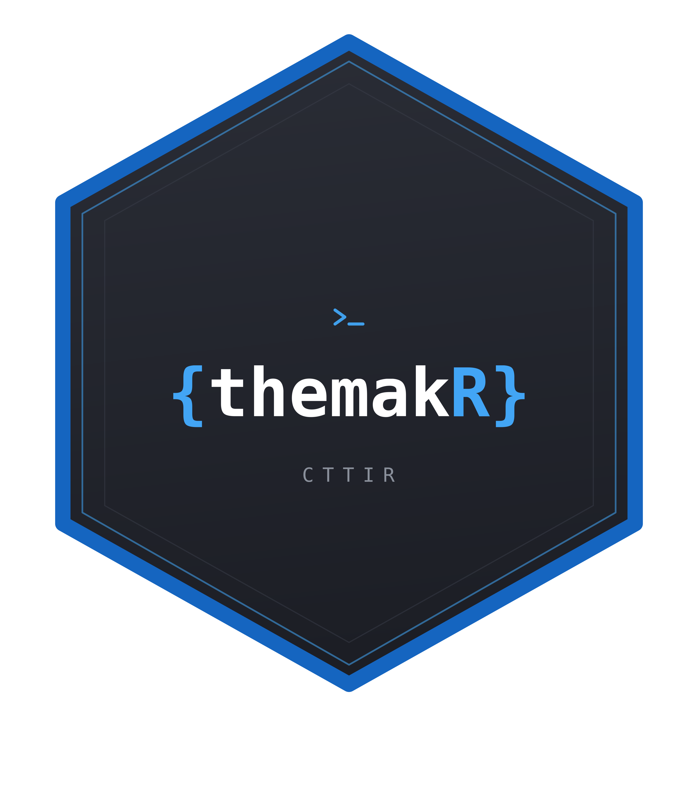

<!-- README.md is generated from README.Rmd. Please edit that file. -->

# themakR 

[](https://doi.org/10.5281/zenodo.21889968)

<!-- badges: start -->
[](https://github.com/CTTIR/themakR/actions/workflows/R-CMD-check.yaml)
[](https://cttir.github.io/themakR/)
[](https://app.codecov.io/gh/CTTIR/themakR?branch=main)
[](https://opensource.org/licenses/MIT)
[](https://lifecycle.r-lib.org/articles/stages.html#experimental)
<!-- badges: end -->

themakR provides the pkgdown template for the
[CTTIR](https://cttir.github.io/website/) package suite: the Hugo Coder
palette of the suite site (light `#fafafa` / dark `#212121`, blue link
accent) with a native light/dark/auto toggle at the top right, Inter for
text, JetBrains Mono for code, the package hex at the top left, a
rotemplate-style navbar and home sidebar, and a shared suite footer.

It plays the same role for CTTIR packages that
[tidytemplate](https://github.com/tidyverse/tidytemplate) plays for the
tidyverse and [rotemplate](https://docs.ropensci.org/rotemplate/) for
rOpenSci: it is not a general-purpose theme and is not on CRAN — it
installs from GitHub and exists so the family of sites looks like a
family.

## Installation

``` r
# install.packages("pak")
pak::pak("CTTIR/themakR")
```

## Usage

In the adopting package’s `DESCRIPTION`:

    Config/Needs/website: CTTIR/themakR

In its `_pkgdown.yml`:

``` yaml
template:
  package: themakR
development:
  mode: auto
```

Then `pkgdown::build_site()`. See `vignette("themakR")` for the full
adoption guide, including the per-package accent override, and
`vignette("showcase")` for a gallery of every styled element in both
colour modes.

## Citation

If you use this software, please cite it as:

> Heller, R. (2026). *themakR: Shared pkgdown theme for the CTTIR package suite* (Version 0.1.0) [Computer software]. Zenodo. https://doi.org/10.5281/zenodo.21889968

DOI: [10.5281/zenodo.21889968](https://doi.org/10.5281/zenodo.21889968)
