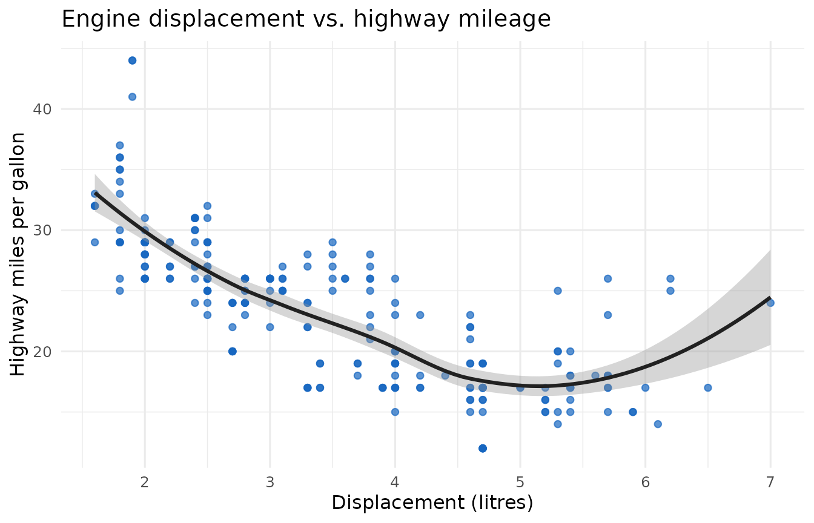

# Element showcase

[](https://github.com/CTTIR/themakR/actions/workflows/R-CMD-check.yaml)
[](https://cttir.github.io/themakR/)
[](https://CRAN.R-project.org/package=themakR)
[](https://app.codecov.io/gh/CTTIR/themakR?branch=main)
[](https://cran.r-project.org/package=themakR)
[](https://cran.r-project.org/package=themakR)
[](https://opensource.org/licenses/MIT)
[](https://lifecycle.r-lib.org/articles/stages.html#experimental)

This page renders one of every styled element so the theme can be
checked visually in both light and dark mode. Use the toggle at the top
right.

## Heading level two

Body copy set in Inter. Here is a [link to the CTTIR
site](https://cttir.github.io/website/), some **bold text**, some
*italic text*, and inline code such as
[`pkgdown::build_site()`](https://pkgdown.r-lib.org/reference/build_site.html)
or `x <- c(1, 2, 3)` set in JetBrains Mono.

### Heading level three

#### Heading level four

## Code

A fenced, evaluated R chunk with output:

``` r

fib <- function(n) {
  if (n < 2) return(n)
  fib(n - 1) + fib(n - 2)
}
vapply(0:10, fib, numeric(1))
#>  [1]  0  1  1  2  3  5  8 13 21 34 55
```

And a static YAML block:

``` yaml
template:
  package: themakR
  bslib:
    primary: "#1565c0"
```

## Table

|                   |  mpg | cyl | disp |  hp | drat |    wt |
|:------------------|-----:|----:|-----:|----:|-----:|------:|
| Mazda RX4         | 21.0 |   6 |  160 | 110 | 3.90 | 2.620 |
| Mazda RX4 Wag     | 21.0 |   6 |  160 | 110 | 3.90 | 2.875 |
| Datsun 710        | 22.8 |   4 |  108 |  93 | 3.85 | 2.320 |
| Hornet 4 Drive    | 21.4 |   6 |  258 | 110 | 3.08 | 3.215 |
| Hornet Sportabout | 18.7 |   8 |  360 | 175 | 3.15 | 3.440 |
| Valiant           | 18.1 |   6 |  225 | 105 | 2.76 | 3.460 |

The first rows of mtcars. {.table}

## Blockquote

> The accent is restrained: it colours links, active navigation, focus
> rings, and the hex border — never large fills.

## Lists

1.  An ordered item
2.  Another ordered item

- An unordered item with `inline code`
- Another unordered item

## Figure

``` r

library(ggplot2)
ggplot(mpg, aes(displ, hwy)) +
  geom_point(colour = "#1565c0", alpha = 0.7) +
  geom_smooth(method = "loess", formula = y ~ x, colour = "#212121") +
  labs(
    title = "Engine displacement vs. highway mileage",
    x = "Displacement (litres)", y = "Highway miles per gallon"
  ) +
  theme_minimal(base_size = 12)
```



## Math

KaTeX rendering: when a \ne 0, the roots of ax^2 + bx + c = 0 are

x = \frac{-b \pm \sqrt{b^2 - 4ac}}{2a}.
